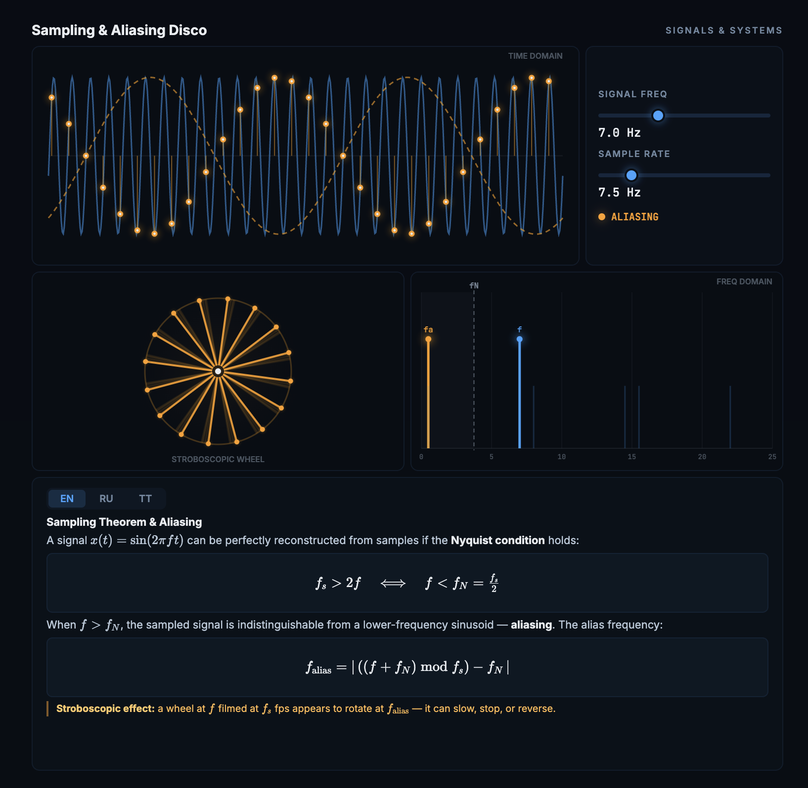

# PhD Escape Visuals

> My dissertation defense is this year. Instead of writing it, I'm building interactive visualizations that absolutely nobody asked for. Every visualization here represents roughly 4-6 hours of *not* writing Chapter 3. Enjoy.

## Visualizations

Each visualization is a single self-contained HTML file. No build tools, no `node_modules` heavier than the dissertation itself -- just open in a browser. All visualizations support **EN / RU / TT** language switching.

### Signals & Systems

| Visualization | What you'll learn (instead of finishing your thesis) | File |
|---|---|---|
| **Sampling & Aliasing Disco** | Nyquist theorem, aliasing, stroboscopic effect | [Open](Signals%20%26%20Systems/sampling-aliasing-disco.html) |
| **Convolution Roller** | Convolution integral, LTI systems, impulse response | [Open](Signals%20%26%20Systems/convolution-roller.html) |

### Probability & Statistics

| Visualization | What you'll learn (instead of finishing your thesis) | File |
|---|---|---|
| **π Coin Estimator** | Monte Carlo estimation of π via random walks and stopping times | [Open](Probability%20%26%20Statistics/pi-coin-estimator.html) |

### Natural Language Processing

| Visualization | What you'll learn (instead of finishing your thesis) | File |
|---|---|---|
| **Tokenizer Zoo** | BPE, WordPiece, Unigram & Byte-level BPE training step-by-step | [Open](Natural%20Language%20Processing/tokenizer-zoo.html) |

## How to use

1. Clone the repo
2. Open any `.html` file in a modern browser
3. Play with the sliders
4. Feel productive while learning nothing new for your defense

## Contributing

If you too are avoiding your thesis, PRs are welcome. Bonus points if you submit one during working hours.

## License

MIT -- because even procrastination should be open source.
