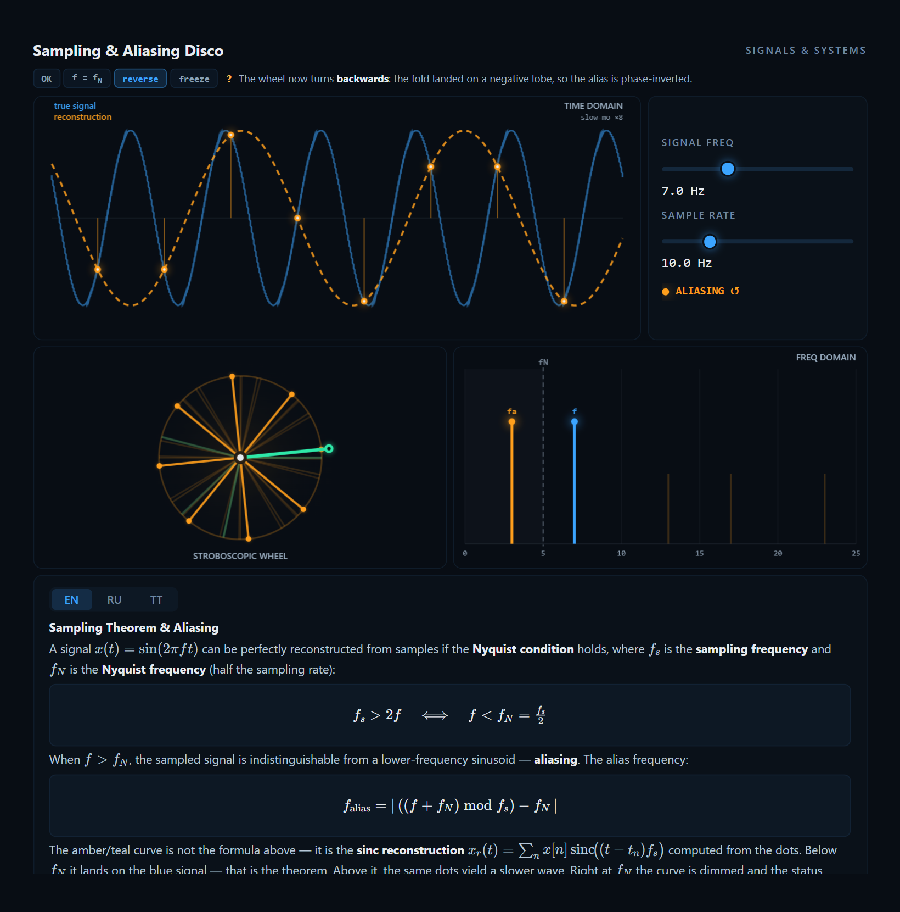
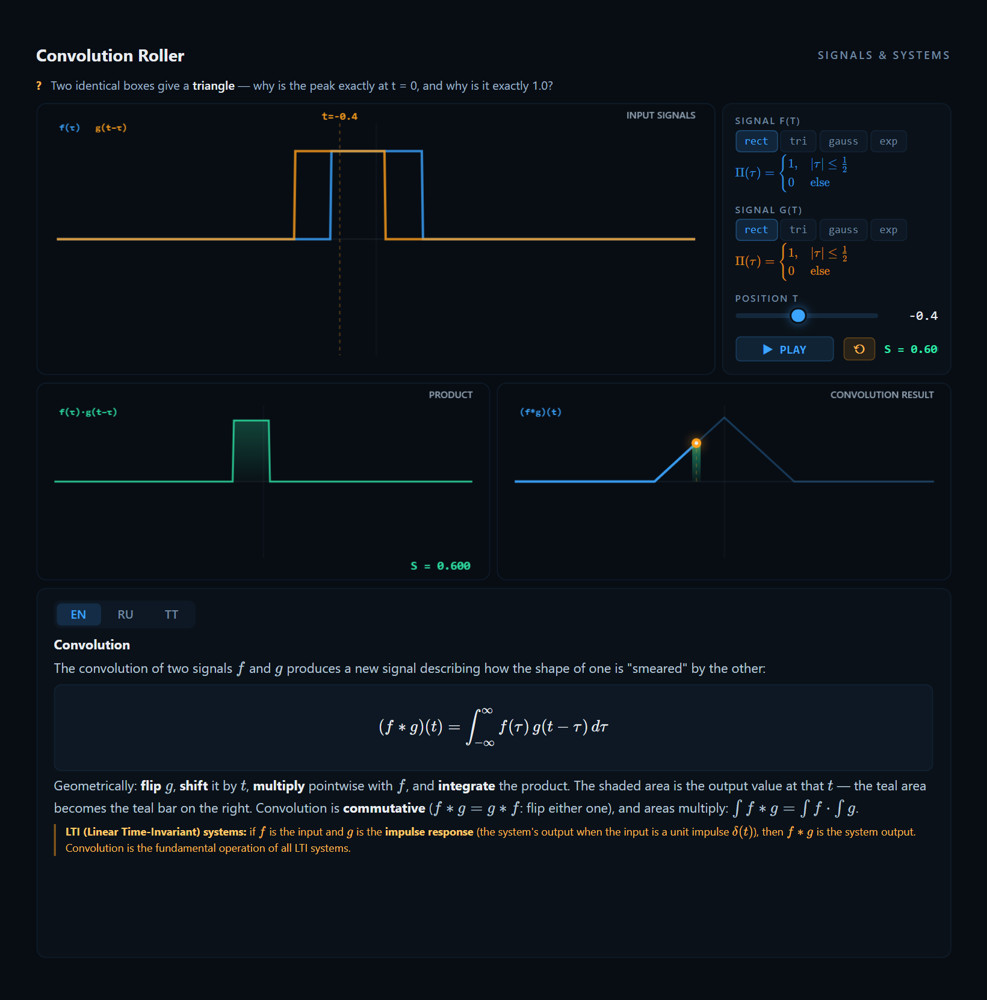
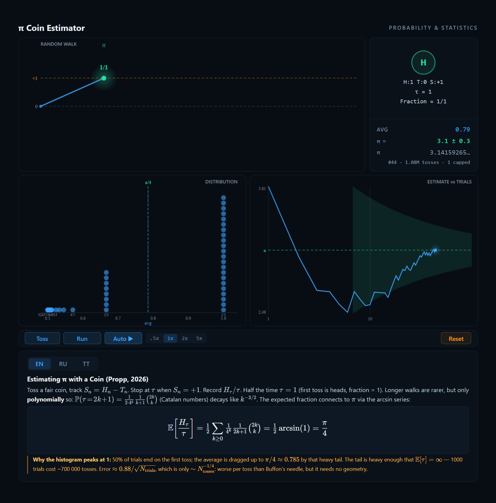
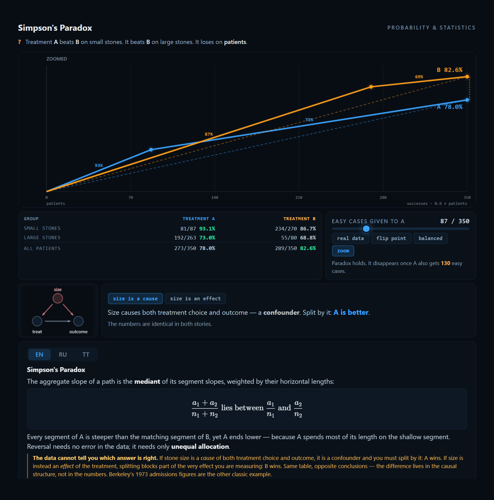
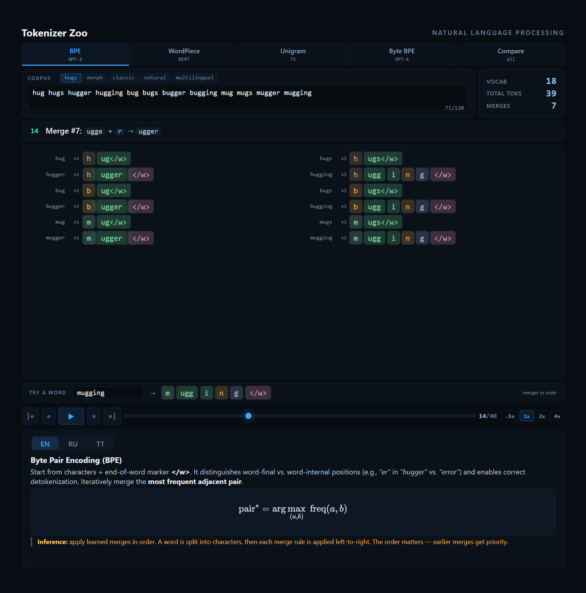
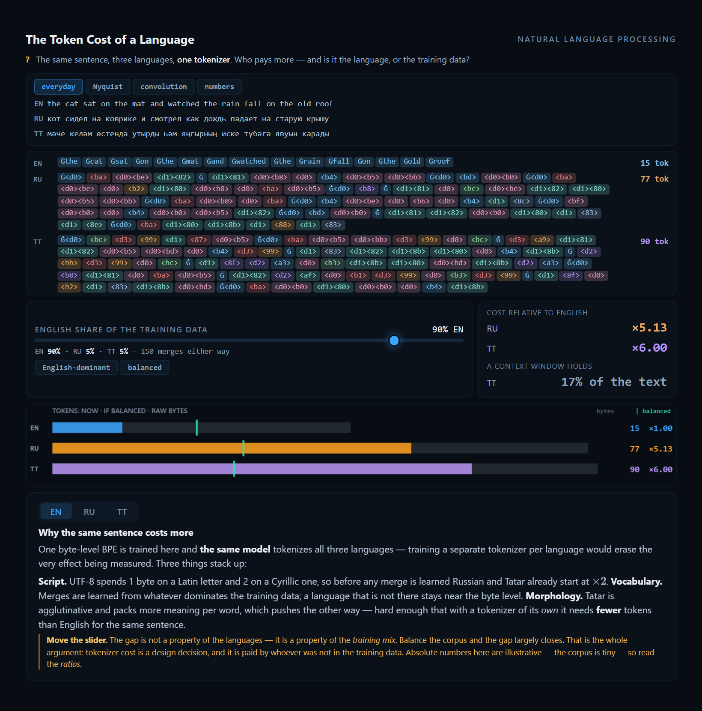

# PhD Escape Visuals

> My dissertation defense is this year. Instead of writing it, I'm building interactive visualizations that absolutely nobody asked for. Every visualization here represents roughly 4-6 hours of *not* writing Chapter 3. Enjoy.



<sub>Above: the *reverse* scenario — the wheel appears to spin backwards, and the amber
curve is the sinc reconstruction of the blue signal's own samples.</sub>

## Visualizations

Each visualization is a single **genuinely self-contained** HTML file: the KaTeX
stylesheet and the woff2 fonts its formulas need are embedded as data URIs, the
formulas are pre-rendered at build time, and the UI uses system fonts. No CDN, no
build tools, no `node_modules` heavier than the dissertation itself — open the
file in a browser, with or without a network connection.

All visualizations support **EN / RU / TT** language switching.

### Signals & Systems

| Visualization | What you'll learn (instead of finishing your thesis) | File |
|---|---|---|
| **Sampling & Aliasing Disco** | Nyquist theorem, aliasing, sinc reconstruction, the stroboscopic effect | [Open](Signals%20%26%20Systems/sampling-aliasing-disco.html) |
| **Convolution Roller** | Convolution integral, flip-and-shift, LTI systems, impulse response | [Open](Signals%20%26%20Systems/convolution-roller.html) |



The sampling demo reconstructs the signal from its own samples with a windowed
sinc kernel rather than asserting an alias formula, so below the Nyquist
frequency you watch the reconstruction land on the original — and above it, the
same dots produce a slower wave. Components sitting inside the reconstruction
filter's guard band are dimmed and labelled instead of being drawn as if a
finite filter could resolve them.

### Probability & Statistics

| Visualization | What you'll learn (instead of finishing your thesis) | File |
|---|---|---|
| **π Coin Estimator** | Monte Carlo estimation of π via random walks and stopping times | [Open](Probability%20%26%20Statistics/pi-coin-estimator.html) |
| **Simpson's Paradox** | Aggregation reversal, the mediant, confounders vs. mediators | [Open](Probability%20%26%20Statistics/simpsons-paradox.html) |





Simpson's Paradox draws each treatment as a **path**: x is patients, y is
successes, so a segment's slope is its success rate and the chord from the
origin is the aggregate. Every segment of A is steeper than B's, yet A ends
lower — it spends most of its length on the shallow segment. A slider moves the
allocation while holding the per-group rates fixed, which makes the reversal
provably a consequence of allocation and nothing else. The second half is the
part that matters: the same table supports **opposite** correct answers
depending on whether the grouping variable is a confounder or an effect of the
treatment, and the numbers alone cannot tell you which.

The stopping time in the π demo has **infinite expectation** (`P(τ > n) ~ √(2/πn)`), so
trials are driven incrementally under a per-frame budget — 1000 trials really do
cost about 700 000 coin tosses, and the demo shows you the count. Displayed
digits are derived from the standard error, so it never claims precision it
does not have.

### Natural Language Processing

| Visualization | What you'll learn (instead of finishing your thesis) | File |
|---|---|---|
| **Tokenizer Zoo** | BPE, WordPiece, Unigram & byte-level BPE, trained step-by-step | [Open](Natural%20Language%20Processing/tokenizer-zoo.html) |
| **The Token Cost of a Language** | Why the same sentence costs 5x more in Tatar than in English | [Open](Natural%20Language%20Processing/token-cost-of-language.html) |





The Token Cost demo trains **one** byte-level BPE and tokenizes the same
sentence in English, Russian and Tatar with it — training one per language
would erase the effect being measured. A slider sets the English share of the
training data, so the gap is shown to be a property of the *training mix*, not
of the languages: at 100% English, Russian costs ×6.2 and Tatar ×7.1; balance
the corpus and both fall below ×1.4, while English itself gets worse, because
the merge budget is shared rather than created. Given a tokenizer of its own,
Tatar needs *fewer* tokens than English for the same sentence.

In Tokenizer Zoo, all four tokenizers get the **same vocabulary budget**, both BPE variants carry a
word-boundary marker (`</w>`, `Ġ`), and any tokenizer that emits `[UNK]` is
excluded from the efficiency ranking — one `[UNK]` is not efficiency, it is a
lost input. The Unigram panel uses a real k-best Viterbi.

## How to use

1. Clone the repo
2. Open any `.html` file in a modern browser
3. Play with the sliders, or pick one of the guided scenarios
4. Feel productive while learning nothing new for your defense

Keyboard: `Space` plays/pauses where applicable, `←`/`→` step, `Home`/`End` jump
to the ends. `F` replays the flip in the convolution demo; `T` / `R` toss and run
in the π demo.

## Development

Every demo is written in `src/` against a shared kit (`shared/kit.css`,
`shared/kit.js`) and built into its shipping location:

```
node tools/build.js <dir with katex.min.js, katex.min.css, fonts/>
```

The build inlines the kit, pre-renders every formula to static KaTeX markup, and
embeds the stylesheet together with only the woff2 faces those formulas use — so
the shipped file has no external references. It refuses to emit a file that still
contains a raw formula, a leftover placeholder, or a stray control character.

`tools/extract.js` recovers a `src/` file from a shipped one (un-rendering the
KaTeX markup back to LaTeX via `data-tex`), and `tools/dekit.js` reports which of
a demo's CSS rules the kit already provides — comparing resolved declarations
rather than text, so `color: #e8ecf0` and `color: var(--text)` count as the same
rule. Together they were how the four original demos were moved onto the kit.

A dependency-free Node test suite lives alongside the project (currently in the
untracked `tmp/` working directory — promote it to `tests/` if you want it in
version control). It covers the numerical claims (sinc reconstruction vs. the
signed alias, convolution quadrature, k-best Viterbi vs. brute force, the
`n^(-1/2)` convergence law), i18n completeness, self-containment, WCAG contrast,
kit integrity (one copy per file, no shadowed helpers, no undeclared uses), and
the absence of stray control characters. Its harness runs the real inline
`<script>` blocks of each demo under a DOM stub — kit first, then the demo, in
document order — so the tests exercise the shipped code rather than a copy.

## Contributing

If you too are avoiding your thesis, PRs are welcome. Bonus points if you submit
one during working hours. Please keep the demos dependency-free.

## License

MIT — see [LICENSE](LICENSE). Bundled KaTeX is MIT, © Khan Academy.
